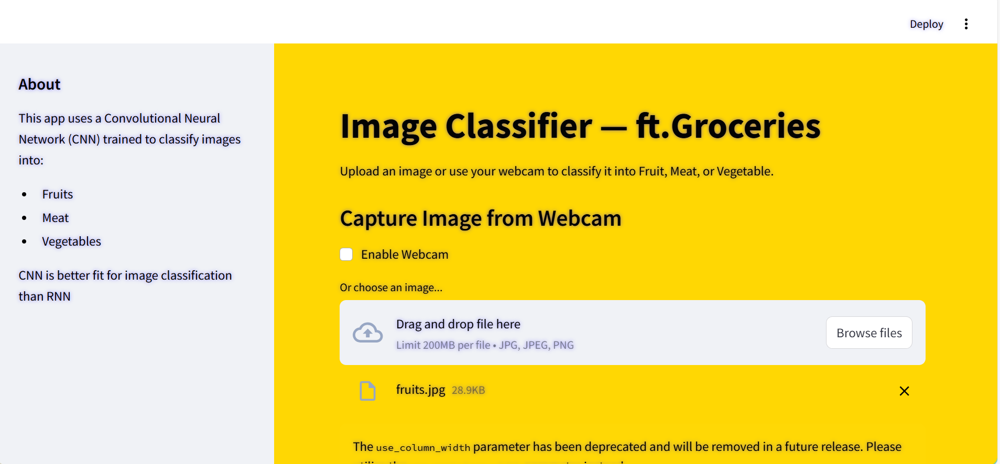

# CNN Image Classifier - Fruits, Meat, Vegetables


A web application built with **Streamlit** and **TensorFlow** to classify images into **Fruits**, **Meat**, or **Vegetables** using a pre-trained Convolutional Neural Network (CNN). This project demonstrates image classification with an intuitive interface and supports both file uploads and webcam capture.

## Features

- **Image Upload**: Upload images (JPG, PNG, JPEG) for classification.
- **Webcam Support**: Capture images directly from your webcam.
- **Real-Time Predictions**: Classify images into Fruits, Meat, or Vegetables.
- **Probability Visualization**: Display a bar chart of class probabilities.
- **Engaging UI**: Responsive Streamlit interface with a dynamic gradient background.
- **Educational Demo**: Built for learning and showcasing CNN capabilities.

## Demo



## Requirements

- Python 3.8 or higher
- TensorFlow 2.x
- Streamlit 1.x
- Pillow
- Matplotlib
- NumPy

### Installation

1. Clone the repository:
   ```bash
   git clone https://github.com/Rishiiitha/cnn-fruits.git
   